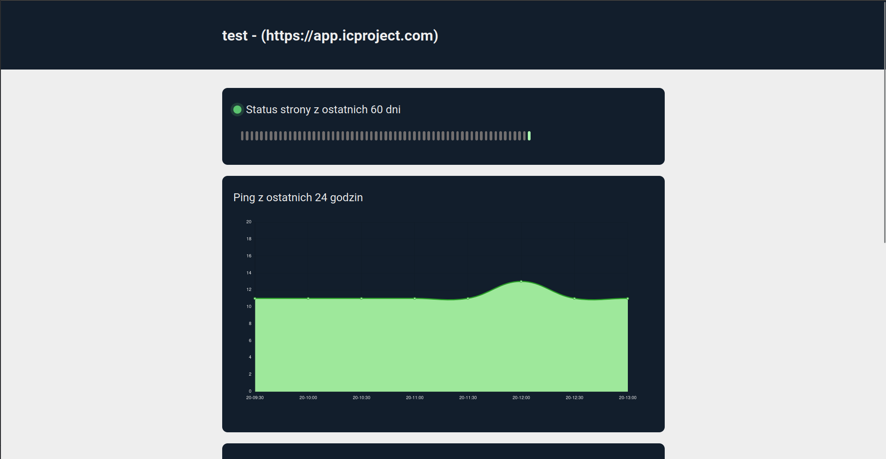
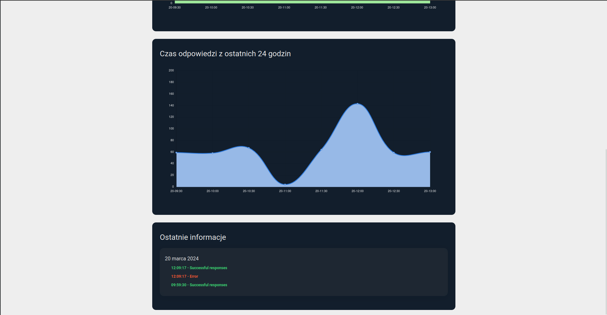

<br/>
<p align="center">
  <h3 align="center">Monitor System</h3>

  <p align="center">
    Django application designed to check the status of a monitored service, such as a website, and notify the user via email of any abnormalities
    <br/>
    <br/>
    <a href="https://github.com/Ernol123/monitor-system/issues">Report Bug</a>
    .
    <a href="https://github.com/Ernol123/monitor-system/issues">Request Feature</a>
  </p>
</p>

  

## Table Of Contents

* [About the Project](#about-the-project)
* [Built With](#built-with)
* [Getting Started](#getting-started)
  * [Prerequisites](#prerequisites)
  * [Installation](#installation)
* [Usage](#usage)
* [Contributing](#contributing)
* [License](#license)
* [Authors](#authors)
* [Acknowledgements](#acknowledgements)

## About The Project


- **SSL Certificate Validation:** The system checks the validity of SSL certificates for monitored websites, ensuring secure connections and identifying potential security vulnerabilities.

- **Website Status Monitoring:** It monitors the availability and responsiveness of websites, allowing users to detect downtime or slow response times promptly.

- **API Access for Invisible Services:** In addition to monitoring visible services like websites, the system provides an API that allows users to monitor invisible services accessible via IP addresses or URLs. This feature enables monitoring of internal services or APIs not directly accessible to the public.

- **Customizable Notification System:** Users can configure their notification preferences, including email alerts, to receive timely notifications about service status changes or abnormalities. This feature ensures that users stay informed about critical events and can take appropriate actions promptly.

- **Multiple Service Monitoring:** The system supports monitoring multiple services simultaneously, providing users with a comprehensive overview of their monitored assets on a single dashboard. Users can easily add, remove, or modify monitored services as needed.





## Built With


* [](https://www.djangoproject.com/)
* [](https://www.python.org/)
* [](https://www.docker.com/)

## Getting Started

To run the application, create a .env file based on the provided template in next section and fill it with your own data.

### Prerequisites

Here is an .env example file

```dotenv
SECRET_KEY="your_key"
DEBUG=True
DATABASES_ENGINE = "django.db.backends.postgresql"
DATABASES_NAME = "postgres"
DATABASES_USER = "postgres"
DATABASES_PASSWORD = "postgres"
DATABASES_HOST = "db"
DATABASES_PORT = 5432
LANGUAGE_CODE = "pl-pl"
TIME_ZONE = "Europe/Warsaw"
EMAIL_BACKEND="django.core.mail.backends.console.EmailBackend"
EMAIL_HOST="your_email_host"
EMAIL_USE_TLS=True
EMAIL_PORT=587
EMAIL_HOST_USER="your_host_email"
EMAIL_HOST_PASSWORD="your_host_password"
CELERY_BROKER_URL = "redis://redis:6379"
CELERY_RESULT_EXTENDED = True
CELERY_ACCEPT_CONTENT = ["application/json"]
CELERY_RESULT_SERIALIZER = "json"
CELERY_TASK_SERIALIZER = "json"
CELERY_RESULT_BACKEND = "django-db"
CELERY_TIMEZONE = TIME_ZONE
CELERY_BEAT_SCHEDULER = "django_celery_beat.schedulers:DatabaseScheduler"
CACHES_BACKEND = "django_redis.cache.RedisCache"
CACHES_LOCATION = "redis://127.0.0.1:6379/1"
CACHES_OPTIONS_CLIENT_CLASS = "django_redis.client.DefaultClient"

```

### Installation

1. Clone the repo

```sh
git clone https://github.com/Ernol123/monitor-system
```

2. Take your .env file to config directory

3. Start docker

```sh
docker-compose up -d --build
```

4. Run migrations

```sh
docker-compose exec web python manage.py migrate
```

5. Create superuser

```sh
docker-compose exec web python manage.py createsuperuser
```

## Usage

**Creating Monitors in the Admin Panel**

1. Navigate to the admin panel by accessing the URL 0.0.0.0:8000/admin in your web browser.
2. Log in with your administrator credentials.
3. Click on the "Monitors" section.
4. Click on the "Add Monitor" button to create a new monitor object.
5. Fill in the required fields with the details of the service you want to monitor, such as its name, URL, and monitoring interval.
6. Save the monitor object.

**Creating a Status Page**

1. In the admin panel, navigate to the "Status Pages" section.
2. Click on the "Add Status Page" button.
3. Fill in the required fields, including the name and slug. The slug will be used to access the status page via the URL.
4. In the "Monitors" field, select the monitors you want to include on this status page.
5. Save the status page object.

**Viewing Monitors on the Status Page**

1. After creating a status page with associated monitors, access it by entering the URL 0.0.0.0:8000/status/<slug> in your web browser, where <slug> is the slug you assigned to the status page.
2. You will see a dashboard displaying the status of the selected monitors, including information such as the status code, response time, and last checked time.
3. Monitor the status of your services conveniently from this centralized dashboard.

**Additional Configuration**

- You can customize the monitoring intervals, notification settings, and other parameters by adjusting the configuration in the Django admin panel or modifying the application settings directly.

## License

Distributed under the MIT License. See [LICENSE](https://github.com/Ernol123/monitor-system/LICENSE.md) for more information.

## Authors

* **Ernest Iwan** - *student of a technical school on an internship at IC Project* - [Ernest Iwan](https://github.com/Ernol123) - **
